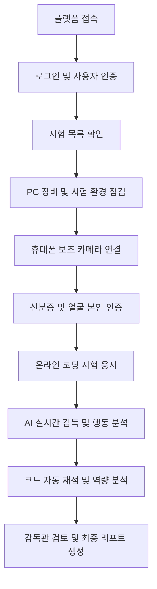

# 🚀 AI 리터러시 역량 테스트 플랫폼

KT AIVLE School 9기 빅프로젝트 23조에서 개발하는  
**실시간 AI 감독 시스템과 자동 평가 파이프라인을 활용한 개발자 역량 평가 플랫폼**의 프론트엔드 애플리케이션입니다.

온라인 시험 과정에서 응시자의 신원을 확인하고, 시험 환경과 의심 행동을 실시간으로 분석하여 공정한 개발 역량 평가 환경을 제공하는 것을 목표로 합니다.

---

## 📌 프로젝트 개요

기존 온라인 코딩 테스트는 응시자의 실제 시험 환경과 문제 해결 과정을 충분히 확인하기 어렵다는 한계가 있습니다.

본 플랫폼은 다음 기능을 결합하여 시험의 신뢰성과 평가의 객관성을 높입니다.

- 시험 전 본인 인증 및 장비 점검
- PC 웹캠과 휴대폰 보조 카메라 연동
- AI 기반 의심 행동 및 금지 물품 탐지
- 코드 작성 과정 및 결과 분석
- 감독관 실시간 모니터링
- 시험 종료 후 종합 역량 리포트 제공

---

## 🛠️ Tech Stack

| 구분 | 기술 |
|---|---|
| Framework | React 19 |
| Build Tool | Vite 8 |
| Routing | React Router DOM 7 |
| HTTP Client | Axios |
| Styling | Custom CSS, Flexbox, Grid |
| CSS Processing | PostCSS, Autoprefixer |
| Mock API | JSON Server |
| Icons | Lucide React |
| QR Code | qrcode.react |
| Lint | Oxlint |

> Tailwind CSS가 패키지에 포함되어 있으나, 현재 주요 화면 스타일은 `main.css` 기반의 Custom CSS를 사용합니다.

---

## 📂 Project Architecture

프로젝트 유지보수성과 확장성을 위해 관리자와 응시자 기능을 역할별 컴포넌트로 분리하였습니다.

```text
frontend/
├── public/
├── src/
│   ├── assets/                      # 이미지 및 정적 리소스
│   │
│   ├── components/                  # 공통 및 역할별 컴포넌트
│   │   ├── Header.jsx               # 권한별 동적 네비게이션
│   │   │
│   │   ├── admin/                   # 관리자 전용 컴포넌트
│   │   │   ├── ExamCreateTab.jsx    # 시험 생성 및 일정 관리
│   │   │   ├── PolicyMgmtTab.jsx    # 문제 및 시험 정책 관리
│   │   │   ├── UserMgmtTab.jsx      # 응시자 및 권한 관리
│   │   │   ├── CheatMgmtTab.jsx     # 부정행위 정책 관리
│   │   │   └── AiConfigTab.jsx      # AI 모델 및 탐지 민감도 설정
│   │   │
│   │   └── applicant/               # 응시자·게스트 컴포넌트
│   │       ├── HomeTab.jsx           # 플랫폼 소개
│   │       ├── ExamTab.jsx           # 정규 평가 목록
│   │       ├── CheckTab.jsx          # 시험 전 장비 점검
│   │       ├── PracticeTab.jsx       # 모의 연습문제
│   │       ├── NoticeTab.jsx         # 공지사항
│   │       └── FaqTab.jsx            # 자주 묻는 질문
│   │
│   ├── pages/
│   │   ├── HomePage.jsx             # 메인 라우팅 및 탭 제어
│   │   └── AuthPage.jsx             # 로그인 및 회원가입
│   │
│   ├── styles/
│   │   └── main.css                 # 전역 및 컴포넌트 스타일
│   │
│   ├── App.jsx                      # 라우터 및 전체 레이아웃
│   └── main.jsx                     # React 애플리케이션 진입점
│
├── package.json
└── README.md
```

## ✨ Key Features
### 1. 역할 기반 접근 제어

사용자 권한에 따라 접근 가능한 메뉴와 기능을 구분합니다.

#### 관리자 ADMIN
* 관리자 전용 네비게이션 제공
* 시험 생성 및 일정 관리
* 문제 및 시험 정책 관리
* 응시자 명단 및 권한 관리
* 부정행위 판정 기준 설정
* AI 분석 모델 및 탐지 민감도 설정

#### 응시자 APPLICANT
* 응시 가능한 시험 확인
* 시험 전 장비 및 환경 점검
* 정규 시험 및 모의시험 응시
* 시험 관련 공지사항과 FAQ 확인

#### 게스트 GUEST
* 플랫폼 소개 확인
* 공지사항 및 FAQ 이용
* 인증이 필요한 기능 접근 시 로그인 안내

## 🧑‍💼 관리자 서비스
* 시험 생성
* 시험명 설정
* 제한 시간 및 문항 수 설정
* 시험 시작·종료 일시 설정
* 시험 세션 등록 및 관리
* 문제 및 정책 관리
* 코딩 테스트 문제 등록
* 허용 프로그래밍 언어 설정
* 문항별 배점 설정
* 컴파일 및 제출 정책 관리
* 응시자 관리
* 응시자 명단 조회
* 응시 승인 상태 확인
* 사용자 계정 및 권한 수정
* 부정행위 정책 관리

다음과 같은 의심 행동에 대한 탐지 기준과 제재 정책을 설정합니다.

* 시선 이탈
* 자리 이탈
* 다중 인물 출현
* 스마트폰 및 금지 물품 탐지
* 이어폰·헤드셋 착용
* 브라우저 화면 이탈
* 비정상적인 음성 및 행동 감지
* AI 분석 설정
* AI 분석 모델 선택
* 객체 및 행동 탐지 Threshold 설정
* 자동 채점 및 코드 분석 모델 설정
* 위험도 산정 기준 관리

## 👨‍💻 응시자 서비스
* 플랫폼 홈
* 플랫폼 주요 기능 소개
* 시험 진행 절차 안내
* AI 기반 평가 방식 확인
* 시험 목록
* 응시 가능한 정규 평가 확인
* 시험 시간과 문항 수 확인
* 시험 입장 및 응시 상태 확인
* 사전 장비 및 환경 점검

시험 시작 전 다음 항목을 확인합니다.

* 웹캠 연결
* 마이크 연결
* 화면 공유 상태
* 인터넷 연결 상태
* PC 브라우저 권한
* 휴대폰 보조 카메라 QR 연동
* 시험 환경 내 다중 인물 및 금지 물품 여부
* 모의 연습문제
* 실제 시험과 유사한 환경 제공
* 코드 작성 및 제출 과정 연습
* AI 감독 환경 사전 체험
* 공지사항 및 FAQ
* 시험 응시 유의사항
* 보조 카메라 설치 방법
* 시험 중 오류 대응 방법
* 자주 발생하는 문제 안내

## 🔄 서비스 플로우 (Service Flow)



## 🤖 AI 연동 예정 기능

프론트엔드는 백엔드 및 AI 서버에서 전달받은 분석 결과를 화면에 표시합니다.

* YOLO11n 기반 사람 및 금지 물품 탐지
* MediaPipe 기반 시선·고개·손·자세 분석
* InsightFace 기반 얼굴 비교
* OCR 기반 신분증 정보 확인
* 음성 및 다중 화자 분석
* 코드 품질 및 유사도 분석
* 부정행위 위험도 산정
* 감독관용 분석 근거 및 리포트 제공

| 명령어               | 설명              |
| ----------------- | --------------- |
| `npm run dev`     | Vite 개발 서버 실행   |
| `npm run build`   | 배포용 프로젝트 빌드     |
| `npm run preview` | 빌드 결과 로컬 미리보기   |
| `npm run lint`    | Oxlint 기반 코드 검사 |

```
React Frontend
      ↓ Axios / REST API
Spring Boot Backend
      ↓
Database / AI Analysis Server
      ↓
객체 탐지 · 행동 분석 · 코드 평가 모델
```
